# gazebo_worlds_collection
A comprehensive set of [Gazebo](http://gazebosim.org/) models and worlds collected from several public projects.

| chessboard.world                                        | cafe.world                                              | car.world                                               |
|:-------------------------------------------------------:|:-------------------------------------------------------:|:-------------------------------------------------------:|
| 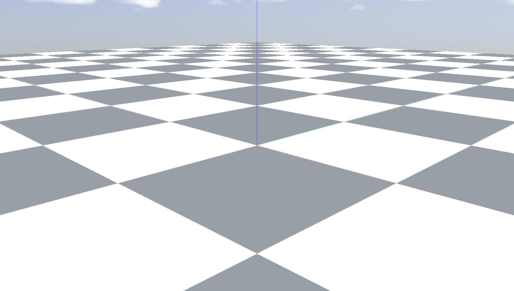          | 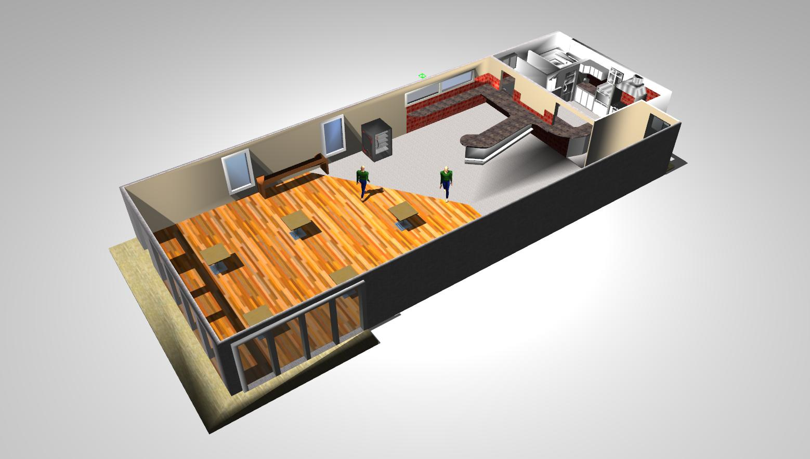                | 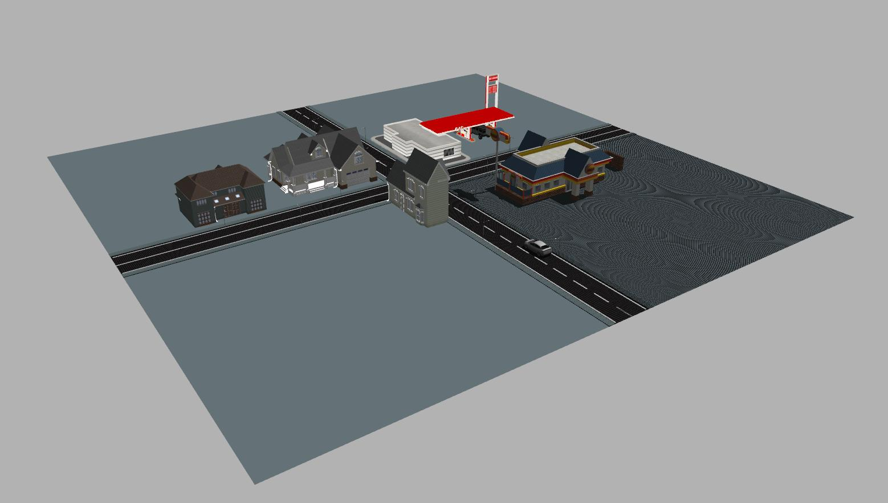                 |
| **distribution_center.world**                           | **factory.world**                                       | **farm.world**                                          |
| 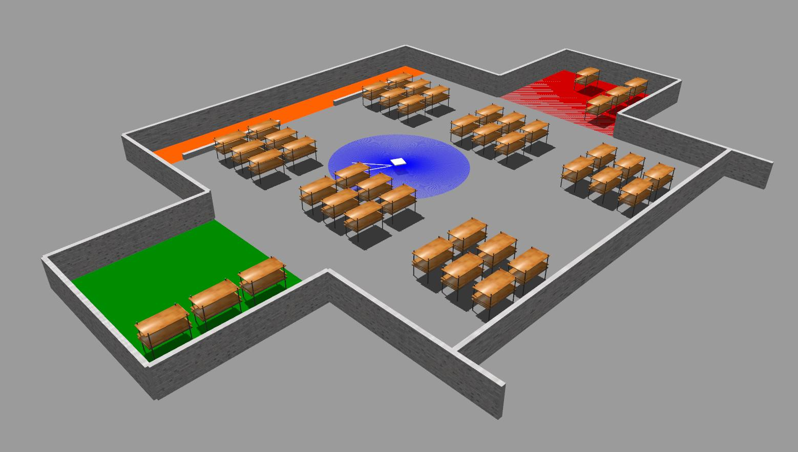 | 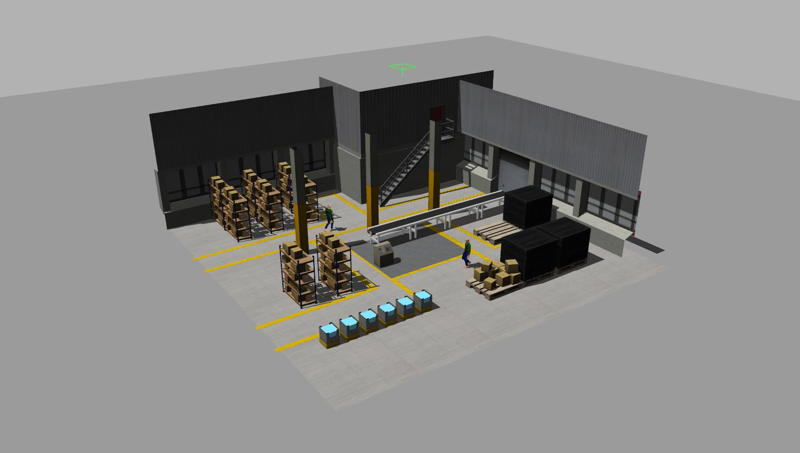             | 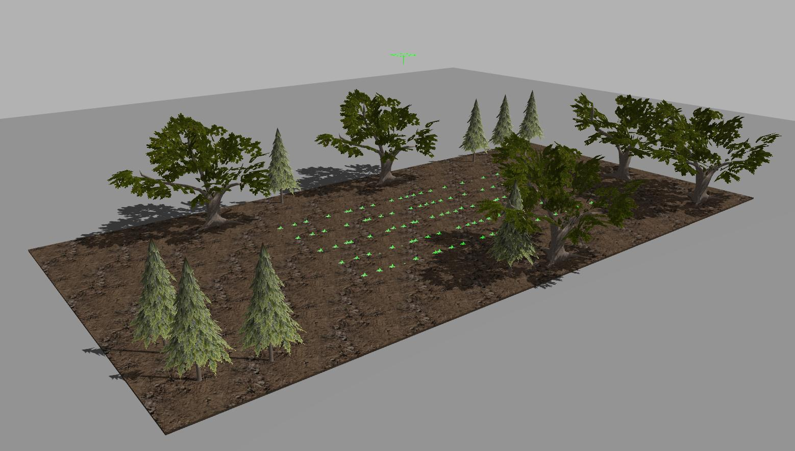                |
| **hospital.world**                                      | **house.world**                                         | **inventory.world**                                     |
| 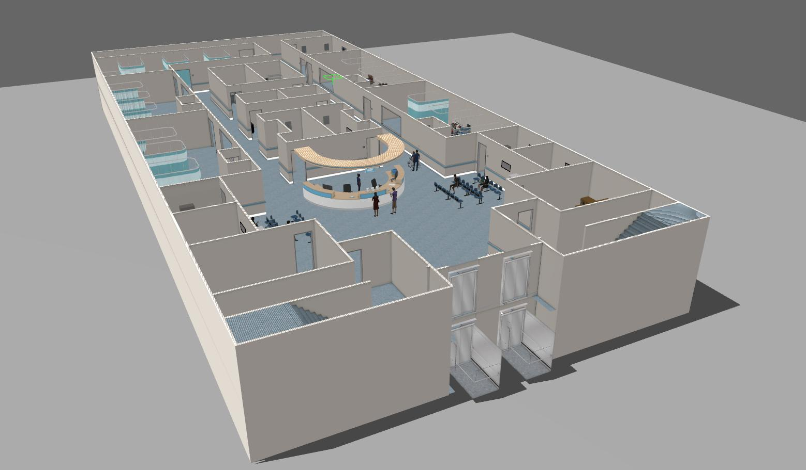            | 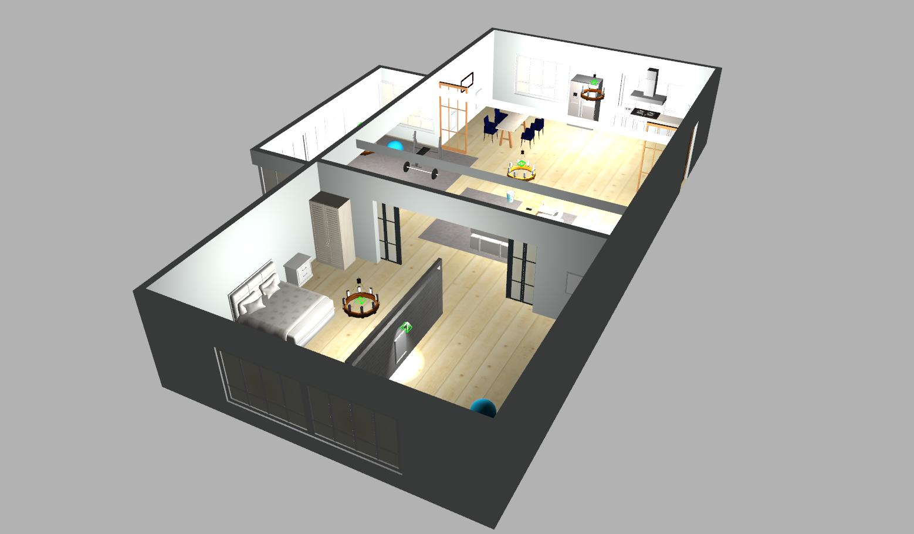               | 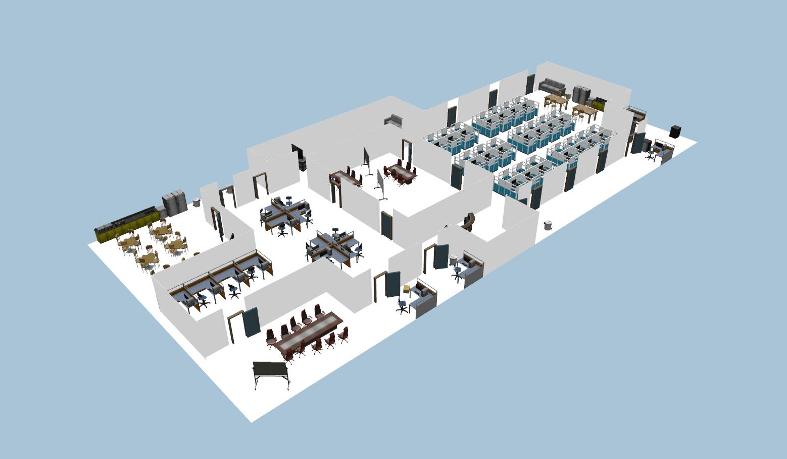              |
| **lawn.world**                                          | **neighborhood.world**                                  | **warehouse.world**                                     |
| 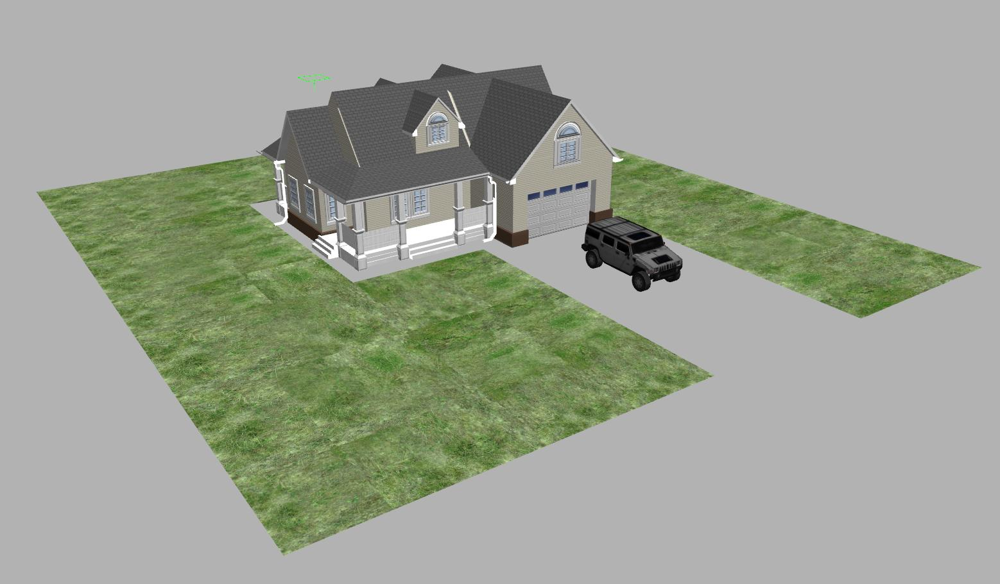                | 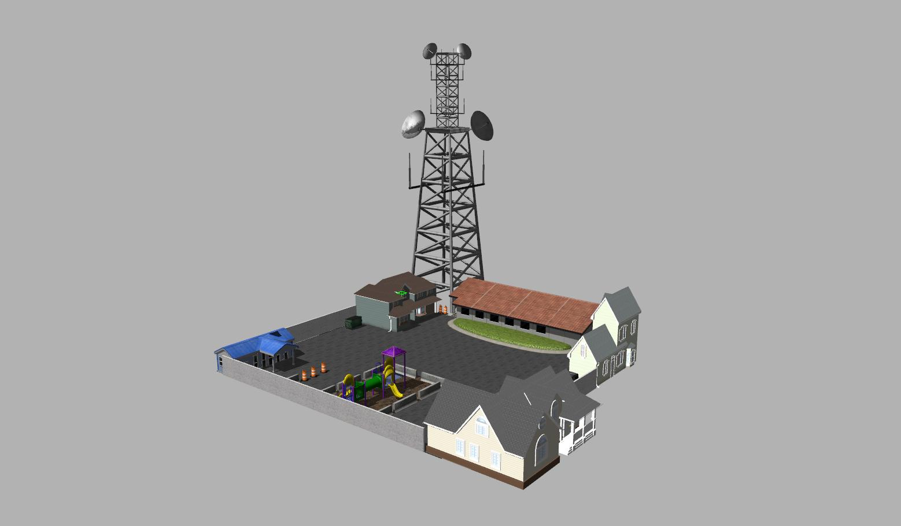        | 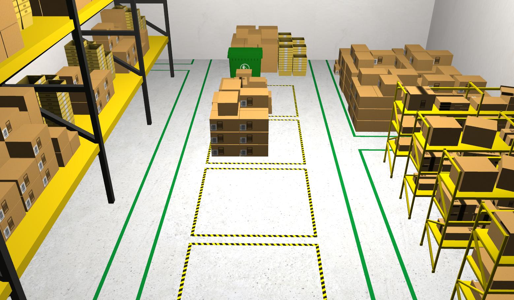           |
| **agriculture.world**                                   | **barrels.world**                                       | **canyonview_field.world**                              |
| 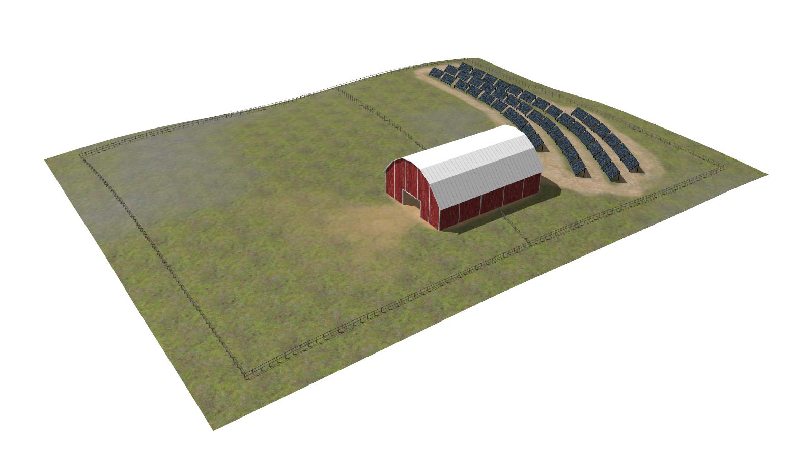         | 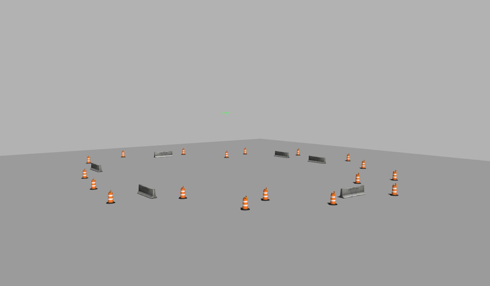             | 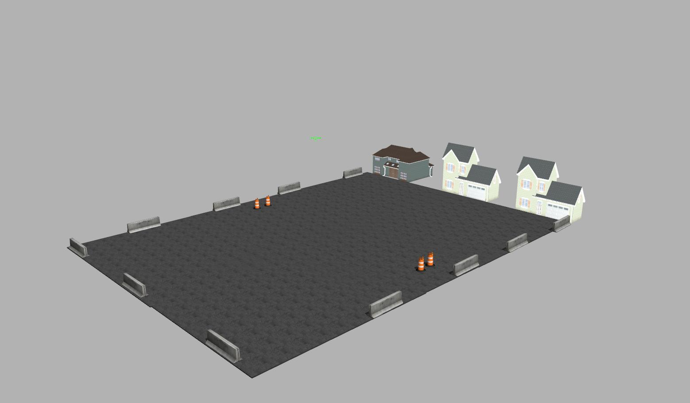    |
| **inspection.world**                                    | **office_earthquake.world**                             | **outdoor.world**                                       |
| 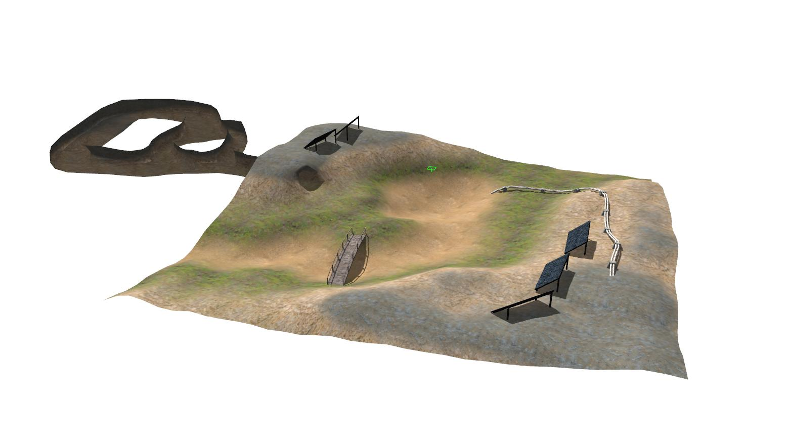          | 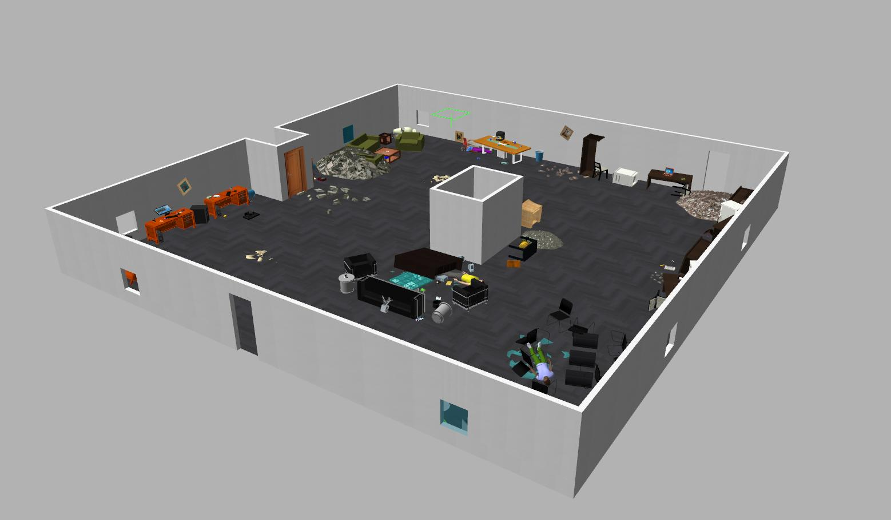   | 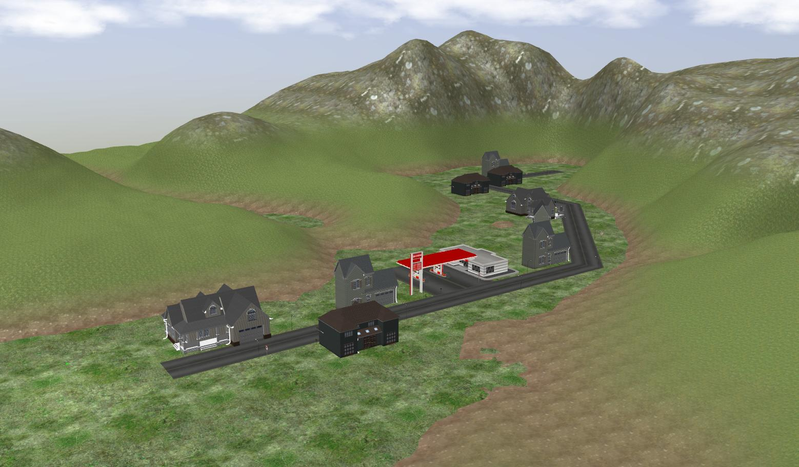             |

## Credits
- [3DGEMS](http://data.nvision2.eecs.yorku.ca/3DGEMS/)
- [chaolmu](https://github.com/chaolmu/gazebo_models_worlds_collection)
 - [RotorS](https://github.com/ethz-asl/rotors_simulator)
 - [TU Delft](https://github.com/tudelft/gazebo_models)
 - [ARTI-Robots](https://github.com/ARTI-Robots/gazebo_worlds)
 - [Clearpath Robotics](https://github.com/clearpathrobotics/cpr_gazebo)
 - [Fetch Robotics](https://github.com/fetchrobotics/fetch_gazebo)
 - [mlherd](https://github.com/mlherd/Dataset-of-Gazebo-Worlds-Models-and-Maps)